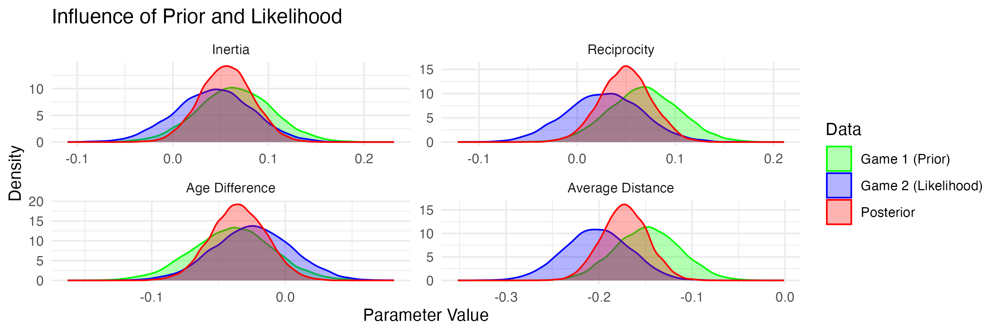

```{r setup, include=FALSE}
knitr::opts_chunk$set(echo = TRUE)
```


```{r, include=FALSE}
library(knitr)
```

\newpage
\pagenumbering{arabic}
# 1. Introduction and Motivation

In the constantly evolving context of football, understanding the dynamic interactions between players is crucial for gaining insights into a team's strategy and performance. Frequentist methods often fall short in accounting for the inclusion of prior information from previous games. This report draws upon Bayesian analysis, specifically through the application of a Bayesian Multinomial Probit Model on Relational Event Data, to provide a more adaptive understanding of pass events in football matches.

Therefore, a Bayesian model estimation procedure will be applied to Relational Event Data which, simply put, captures interactions between entities over time. The goal of the analyses carried out here, is to identify predictors for the receiver of a pass given a certain sender. Specifically, the subject of analysis will be players from VfB Stuttgart. Due to availability, a first set of passes was retrieved from their game against Bayer Leverkusen in December 2023 on which a model was applied with an uninformative prior ($p(\beta) \propto 1$). To demonstrate the practicality of Bayesian methods, the posteriors from this game will be used as priors in the analysis of the second time these two teams met.

Thus, the main advantage of Bayesian analysis that is aimed to be showcased in this report is its use for updating beliefs by incorporating prior knowledge into a model and testing hypotheses about it. Here, advantages of Bayesian analysis are however not limited to this. Considering the four main reasons @van_de_schoot_bayesian_2014 mention for using Bayesian analyses, it entails a different definition of probabilities as will be discussed in the interpretation of the results that may be easier to grasp than its Frequentist counterpart and allows to look at a whole distribution of possible parameters. As will be demonstrated later, Gibbs sampling additionally allows for a model that is easier to identify than a Maximum Likelihood Estimation model.
In addition to model estimation, Bayesian hypothesis testing will be carried out on the estimated network parameters retrieved from the model. Specifically, approximated adjusted fractional Bayes factors (AAFBF) will be applied, allowing to move beyond traditional null hypothesis testing, i.e. simply testing whether parameters are equal [@van_de_schoot_informative_2010]. Instead, the chosen approach enables testing multiple informative hypotheses, i.e. hypotheses about the ordering of multiple parameters [@van_de_schoot_informative_2010], against each other and an unconstrained hypothesis, i.e. a hypothesis with no constraints about the ordering of the parameters making any ordering equally likely [@van_de_schoot_informative_2010]. Furthermore contrary to $p$-values typically used in Frequentist statistics limited to providing the probability of the data given a certain hypothesis, Bayes Factors provide a continuous measure of evidence for or against a hypothesis given the data, allowing for a more nuanced interpretation of the results.

# 2. The Data

The data used in this analysis is event data of successful passes that were played by VfB Stuttgart's players in their two games against Bayer Leverkusen in the Bundesliga season 2023/24 and was retrieved from StatsBomb's open-data GitHub repository [@statsbomb_statsbomb_2024]. In the main model of interest, the information gathered from the first game will be used as a prior in the analysis of the data from the second game. For both matches, successful passes between VfB Stuttgart's players were extracted as events and each player's average position (for simplicity only the first half) was calculated to serve as a predictor variable. Additionally, each player's age was scraped from @transfermarkt_vfb_2024 allowing to include each potential receivers age difference with the sender as a predictor variable. Lastly, inertia, a common network statistic indicating the tendency of players to maintain existing connections over time, and reciprocity, the mutual exchange of connections between players, were included as predictor variables for a tie (here: pass being played) between two players. The variables were standardized to enable comparing their parameters.


# 3. The Model

## 3.1 The Bayesian Multinomial Probit Model for Relational Event Data

A Bayesian Multinomial Probit Model as described by @karimova_separating_2023 was then applied. Briefly put, for each event $e_i$ ($i \in \{1,\dots,M\}$) a latent score $Z_{ir}$ is assigned to $N$ potential receivers in the risk set $\mathcal{R}_{actor}$ (here: all starting players from VfB Stuttgart that are not the passer). This latent score is determined by a set of observed predictor variables $X_i$ and a vector of network parameters $\beta$. The receiver $r$ with the largest score $Z_{ir}$ will be the predicted receiver of the event. Thus:
$$Z_i = X_i\beta + \epsilon_i \quad \text{and} \quad Y_i(Z_i) = r \quad \text{if} \quad \text{max}(Z_i) = Z_{ir}$$
Here, $X_i$ is an $N \times P$ matrix of observed predictor variables at time $i$, $\beta = (\beta_1, \ldots, \beta_P)^T$ is a vector of network parameters, and  $\epsilon_i$ is a Normal error term centered at zero with an identity covariance matrix to ensure the identifiability of the model. This implies the following regression equation, for the data given here:
$$Z_i = \beta_1 \text{Inertia}_i + \beta_2 \text{Reciprocity}_i + \beta_3 \text{Age Difference}_i + \beta_4 \text{Average Distance}_i + \epsilon_i$$
In order to keep the risk sets $\mathcal{R}_\text{actor}$ simple, only passes before the first substitution were retrieved. This resulted in 381 pass events for the first match and 367 for the second match.

## 3.2 Model Estimation

To allow for the use of a Gibbs sampler enabling the addition of prior knowledge through conjugate priors (here: Normal priors), conditional posteriors were derived (see derivation in Appendix). The Gibbs sampler was then used to estimate the multivariate Normal posterior distribution of the network parameters $\beta$ by iteratively sampling $\beta^{(s)}|Z^{(s-1)}$ from a Normal and $Z^{(s)}|\beta^{(s)}$ from a truncated Normal distribution. Specifically:

$$\beta^{(s)}|Z^{(s-1)} \sim \mathcal{N}(\mu_\beta, \Sigma_\beta) \quad \text{with} \quad \mu_\beta = \left( \sum_{i=1}^{M} X_i^T X_i + \Sigma_0^{-1} \right)^{-1} \left( \sum_{i=1}^{M} Z_i^T X_i + \mu_0^T \Sigma_0^{-1} \right) \quad \text{and} \quad \Sigma_\beta = \left( \sum_{i=1}^{M} X_i^T X_i + \Sigma_0^{-1} \right)^{-1}$$
$$ \text{and} \quad Z_i^{(s)}|\beta^{(s)} \sim t\mathcal{N}(X_i\beta^{(s)},I_N)$$
where $s$ is the iteration. Conditional posteriors for the model with $p(\beta) \propto 1$ can be found in the Appendix. As done by @karimova_separating_2023, the first component of each $Z_i$ was fixed to zero to reduce the degrees of freedom and the density for the observed receiver of a tie was truncated on the interval ($\text{max}_{r \neq r_i}Z_{ir}, \infty$) and ($-\infty,Z_{ir}$) for all other actors in the risk set.

The application of a Metropolis-Hastings sampler was also considered as it also allows for incorporating non-conjugate priors (here: priors that come from a different distribution than the Normal distribution), however, since the prior information retrieved from the first match was approximately normally distributed, a Gibbs sampler was chosen as it is computationally more efficient considering an already high runtime of the Gibbs sampler.
Convergence of the sampler was then assessed using the Gelman-Rubin statistic, trace plots as well as an inspection of autocorrelation. After initially running the sampler for 10,000 iterations and discarding the first 1,000 as burn-in the sampled values showcased considerable autocorrelation as well as nonconvergence. Consequently, only every 5th iteration was retained for further analysis to encounter autocorrelation (so-called thinning) and the number of samples was increased to 50,000 to retrieve the same number of sampled values as before, leading to no signs of nonconvergence. Figure 1 shows the trace plots for the network parameters $\beta$.
	
	
\begin{figure}[h]
\begin{subfigure}{.5\textwidth}
\includegraphics[]{output/trace_plots.png}
\end{subfigure}%
\begin{subfigure}{.5\textwidth}
\includegraphics[]{output/trace_plots_upd.png}
\end{subfigure}
\caption{Trace plots for the Gibbs samplers for the first game including a uniform uninformative prior and the second game including information from the first game as prior. }
\end{figure}
	
The Gelman-Rubin statistic, comparing variance within and betwen chains, for all network parameters was close to 1 and below the commonly used threshold of 1.05 in all of the computed models (see code), indicating no sign of nonconvergence of the chains. The trace plots further show that the chains  mixed well and do not show any signs of autocorrelation. Additionally, autocorrelation was around 0.2 at lag 1, steadily decreasing from thereon. Thus, the model estimation procedure can be considered successful.

Verifying the sampler's estimates' validity somewhat posed a challenge due to the complexity of relational event data not allowing to easily generate a test data set (e.g. by iteratively sampling Normal predictor variables for each potential receiver at each time point, calculating the values for $Z$ as linear combinations with the constrained residual variance, and choosing receiver with the highest score in $Z_i$ as the actual receiver). Additionally, the lack of packages in R, implementing this exact model did not allow for a comparison of the sampler's estimates to the true values. For this reason, the only reliable way of testing the sampled values was to apply the functions published by @karimova_separating_2023 to the data set and comparing the estimated network parameters with the model with a flat prior. This lead to very similar results for different subsets of the data, indicating that the sampler's estimates are reliable. The observed difference between the estimates is assumed to be due randomness in sampling. Additionally, software packages applying other estimation procedures were used to compare the results to the sampler's estimates. These resulted in estimates with the same order and similar magnitude, thus further supporting the reliability of the sampler's estimates. The correctness of the priors was assessed with different prior specifications, as can be seen in the code.

## 3.3 Results

In a first step, the parameters were estimated through Gibbs sampling for the first match. Given, that there is no prior evidence for any of the network parameters, a uniform uninformative prior $p(\beta) \propto 1$ was used, thus resulting in a posterior distribution entirely driven by the data and a posterior mode that is approximately equal to a Maximum Likelihood Estimate. The posterior mode for the parameter for inertia was 0.070, for reciprocity 0.066, for age difference -0.042, and for average distance -0.156. Thus, given only the data from the first match and no prior evidence, these are the values that maximize the posterior distribution, i.e. the most probable values for the true parameter given the data. Contrasting to a Frequentist analysis relying on Maximum Likelihood estimation Bayesian analysis however looks at the entire posterior distribution of the parameters, as the parameter is not seen as a fixed value but rather as a probability distribution of possible parameter values.

As it is not sufficient to describe a distribution just by one measure of central tendency, the posterior mean (i.e. the expected value of the parameters), was $[0.065, 0.068, -0.039, -0.148]^T$. The posterior standard deviation of the parameters was 0.039 for inertia, 0.036 for reciprocity, 0.031 for age difference and 0.035 for average distance. The 95% highest density credible interval for the parameters was $[-0.011,0.142]$, $[0.001,0.141]$, $[-0.100,0.020]$, and $[-0.214,-0.078]$, respectively. Substantively interpreted, this means given only the collected evidence from the two matches there is a 95% probability (here: degree of logical support) that the true network parameters within these ranges, given only evidence from the first game. This is more intuitive than the abstract interpretation of confidence intervals in Frequentist statistics, which are often misinterpreted, and actually only mean that if we repeated the sampling many times, 95% of those intervals would contain the true parameter. Looking at the direction of the effects, the probability for inertia and reciprocity to be positive given the data from the first game is 95.23% and 97.25%, respectively, while the probability for age difference and average distance to be negative is 90.58% and asymptotically close to 100%, respectively. This means that given the data from the first game, there is a high degree of certainty about the direction of the effects.

\begin{figure}[h]
\begin{subfigure}{.5\textwidth}
\includegraphics[]{output/density_plots.png}
\end{subfigure}%
\begin{subfigure}{.5\textwidth}
\includegraphics[]{output/density_plots_upd.png}
\end{subfigure}
\caption{Density plots of the network parameters $\beta$ for the first match and after updating.}
\end{figure}

In a second step, the evidence collected from the first game was incorporated as prior evidence in the analysis of passes in the same fashion in the second game between these two teams, leading to a Normal prior with
$$\mu_0 =
\begin{pmatrix}
0.06475460 \\
0.06831841 \\
-0.03949577 \\
-0.14780191
\end{pmatrix} \quad \text{and} \quad \Sigma_0 =
\begin{pmatrix}
1.52 \times 10^{-3} & -7.78 \times 10^{-4} & 1.42 \times 10^{-4} & 1.96 \times 10^{-4} \\
-7.78 \times 10^{-4} & 1.29 \times 10^{-3} & -3.61 \times 10^{-5} & 2.35 \times 10^{-4} \\
1.42 \times 10^{-4} & -3.61 \times 10^{-5} & 9.32 \times 10^{-4} & 1.51 \times 10^{-4} \\
1.96 \times 10^{-4} & 2.35 \times 10^{-4} & 1.51 \times 10^{-4} & 1.23 \times 10^{-3}
\end{pmatrix}$$
This lead to symmetric and unimodal posterior distributions that were much narrower than those from the analysis just incorporating the data from the first match, as the data from both games showcase very similar effects (as was assessed by retrieving posterior distributions for the second game with a flat prior). Thus the posterior distribution of the network parameters $\beta$ for the updated model was much more concentrated around the values that were common in both games. The posterior mean was now $\beta=[0.056, 0.049, -0.035, -0.172]^T$. The posterior standard deviation of the parameters decreased to 0.027 for inertia, 0.026 for reciprocity, 0.021 for age difference and 0.025 for average distance, further demonstrating the increased precision of the estimation after incorporating prior information in the analysis. The 95% highest density credible interval for the parameters were now [0.001,0.108], [-0.001,0.101], [-0.074,0.007] and [-0.222,-0.125], showing that given the data from the two matches there is now a narrow range of parameters including the parameter with 95% probability and indicating that there is high evidence for the effects being generally weak. Concerning, the direction of the effects, evidence gathered from the first game was now even stronger.

The influence of the prior (information from the first match) and the likelihood (information from the second match) already becomes apparent when looking at the conditional posteriors of the network parameters $\beta$ for the second match. The data from both games equally influence the conditional posterior's covariance matrix $\Sigma$ because it is calculated as the inverse of the sum of the product of the transpose of the design matrix and the design matrix, taken across all time points and both matches ( $\Sigma_{\text{updated}}=(\Sigma^{-1}_{\text{Game1}}+\Sigma^{-1}_{\text{Game2}})^{-1}$). The influence of prior and likelihood on the conditional posterior's means is more complex: Since $\Sigma_{\beta}$ is influenced by the inverse of $\Sigma_0$, the prior mean $\mu_0$ becomes more influential on the sampled values, the lower the prior variance is. Since the variance of the coefficients in the first match approximately equals that of the second match, the  prior and likelihood influence the posterior equally strongly. This can be visualized by the density plots below displaying results from posteriors of the first (demonstrating the influence of the prior) and second game (demonstrating the likelihood) with the non-informative prior $p(\beta) \propto 1$ and the results of the updated model.



# 4. Bayesian Hypothesis Testing
## 4.1 Hypothesis Testing Framework

In order to test hypotheses about the estimated network parameters, Bayes Factors were calculated. Bayes Factors generally indicate how much more likely the data are to be observed under one hypothesis compared to another. Thus, they are the ratio of the marginal likelihoods of the data under two different hypotheses, i.e. $BF_{ii'}=\frac{m(X|H_i)}{m(X|H_{i'})}$.
Here, approximated adjusted fractional Bayes factor (AAFBF) are used: The AAFBF of an informative hypothesis against the unconstrained hypothesis approximates the fractional Bayes factor [@ohagan_fractional_1995] by using a Normal distributed marginal posterior. The prior mean is chosen as the focal point of interest [@gu_approximated_2018], thus leading to
$$AAFBF_{iu} = \frac{\int_{\theta \in \Theta_i} \pi_u (\theta | \mathbf{X}) d\theta}{\int_{\theta \in \Theta_i} \pi^*_u (\theta | \mathbf{X}^b) d\theta}.$$
In words, the Bayes Factor is thus approximated by the ratio of the proportion of the posterior distribution retrieved from the Bayesian Model Estimation in line with a specified hypothesis to the proportion in line with a prior distribution based on a fraction of the data and centered at the focal point of interest.
Here, the following four hypotheses were specified and are tested against each other and an unconstrained hypothesis, inspecting the ordering of the predictors:
$$H_1: -\beta_{\text{Age Difference}} < \beta_{\text{Reciprocity}}<\beta_{\text{Inertia}}<-\beta_{\text{Avg Distance}}$$
$$H_2: -\beta_{\text{Age Difference}} <\beta_{\text{Inertia}}< \beta_{\text{Reciprocity}}<-\beta_{\text{Avg Distance}}$$
$$H_3: \beta_{\text{Reciprocity}}< -\beta_{\text{Age Difference}} < \beta_{\text{Inertia}}<-\beta_{\text{Avg Distance}}$$
$$H_4: \beta_{\text{Inertia}}<-\beta_{\text{Age Difference}} < \beta_{\text{Reciprocity}}< -\beta_{\text{Avg Distance}}$$

$[0,0,0,0]$ was chosen as the focal point of the prior distribution as described by @gu_approximated_2018 for both sets of hypotheses, as it satisfies $\beta_{\text{Reciprocity}}= -\beta_{\text{Age Difference}} = \beta_{\text{Inertia}}=-\beta_{\text{Avg Distance}}$.
Concerning the fraction of information used for the covariance matrix in the prior distribution $b_{robust}$ was chosen, because - as shown by @conigliani_sensitivity_2000 - sensitivity decreases as the chosen fraction $b$ increases and the "AAFBF additionally becomes more similar to the non-approximated adjusted fractional Bayes factor" [@gu_approximated_2018]. Here, since $n=MN$, $b_{robust}=\text{max}\{\frac{P+1}{MN}; \frac{1}{\sqrt{MN}}\}=\frac{1}{\sqrt{MN}}=0.017$. To assess sensibility of the results to this, the Bayes Factors were also calculated using $b_{min}$ as described by [@gu_approximated_2018].
Results were additionally compared to those retrieved from the `bain` package applying the AAFBF [@gu_bain_2023] to assess their validity.

## 4.2 Results

As can be seen by $BF_{1u}$, $BF_{2u}$, $BF_{3u}$ and $BF_{4u}$ being above 1 in Table 1, all specified hypotheses are more likely than the unconstrained hypotheses given the data. Specifically, evidence is strongest for $H_1$ with $BF_{1u}=12.91$, implying $H_1$ is about 13 times more likely given the data than $H_u$ proposing any order of strength of predictors. However, against $H_2$ it is only slightly more likely as $BF_{12}=1.23$, while it is about 3 times more likely than $H_3$ and $H_4$ ($BF_{13}=2.83$ and $BF_{14}=4.03$; since $BF_{ij}=\frac{BF_{iu}}{BF_{ju}}$). The posterior model probabilities $PMP_a$ and $PMP_b$ make clear that evidence for none of the hypothesis is completely convincing. Given the posterior model probability of around 40% for $H_1$ when including the unconstrained hypothesis, the error probability for this hypothesis is 60%, suggesting sparse evidence implying that it is more likely that any of the other specified hypotheses (most probably $H_2$ with a PMP of 33%) fits the data better. Generally, the unconstrained hypothesis appears unlikely with a PMP of 3%, indicating that the data does not support the assumption that the parameters can take on any value, but the specified hypotheses all seem relatively reasonable. In line with that, the Bayesian error probability is comparably high when only considering the specified hypotheses without $H_u$ (specifically 59% for $H_1$ and 66% for $H_2$). This suggests that the data does not provide strong evidence for any of the specified hypotheses.
\begin{table}[ht]
\centering
\begin{tabular}{lrrrrr}
  \hline
Hypothesis & Fit & Complexity & $BF_u$ & $PMP_a$ & $PMP_b$ \\ 
  \hline
$H_1$ & 0.32 & 0.02 & 12.91 & 0.41 & 0.40 \\ 
  $H_2$ & 0.25 & 0.02 & 10.50 & 0.34 & 0.33 \\ 
  $H_3$ & 0.22 & 0.05 & 4.56 & 0.15 & 0.14 \\ 
  $H_4$ & 0.16 & 0.05 & 3.20 & 0.10 & 0.10 \\ 
  $H_u$ & & & & & 0.03 \\ 
   \hline
\end{tabular}
\end{table}
As was discussed in Section 2.3, the sensitivity of the results to the fraction of information used in the prior distribution was assessed. To do so, the Bayes Factors were also calculated using $b_{min}$ as introduced earlier, uncovering no change, as was to be expected due to no equality constraints [see, @gu_approximated_2018]. Thus, the Bayes factors here are insensitive to the chosen prior distribution.

Lastly, the resulting complexities and fits were compared to those from `bain` [@gu_bain_2023]. As `bain` applies $b_{min}$ as the fraction of data used to assess the hypotheses, this was also used in the calculations here. Bayes Factors were not exactly equal, but only deviated very slightly (with complexities and fits deviating at most by 0.01). This is likely due to the different estimation procedures used in the two analyses, as the approach taken here is built on sampling and not on integrating the prior and posterior density functions, as results consistently matched for simpler hypotheses with less constraints. 

# 5. Conclusion and Reflection

To showcase the advantages of Bayesian methods, a Multinomial Probit Model was applied to analyze relational event data from football matches, focusing on pass events between players. Several methodological advantages, particularly in incorporating prior information and providing a nuanced interpretation of parameter estimates as well as the evaluation of informative hypotheses were pointed out and the influence of prior evidence was discussed. 
Alltogether, this report, however, only scratched the surface of what could be done in this context. Future work could, for example, apply weighting of priors by the number of minutes or passes played in a fashion similar to power priors. An extension to more commonly used Relational Event Models would additionally be fruitful. The use of a Bayesian Multinomial Probit Model for Relational Event Data, however, was shown to be a promising approach to analyzing passes.

\newpage

# References

<div id="refs"></div>

\newpage

# Appendix

## A1: Derivation of the Conditional Posterior Distribution

Since $Z_i \sim \mathcal{N}(X_i\beta,I_N)$, the likelihood function can be written as:

\begin{align*}
f(X,Z|\beta) &= \prod_{i=1}^{M} \frac{1}{(2\pi)^{N/2}||^{1/2}} \exp\left(-\frac{1}{2}(Z_i-X_i\beta)^TI_N(Z_i-X_i\beta)\right) \\
f(X,Z|\beta) &= \prod_{i=1}^{M} \frac{1}{(2\pi)^{N/2}} \exp\left(-\frac{1}{2}(Z_i-X_i\beta)^T(Z_i-X_i\beta)\right)
\end{align*}

### A1.1 Derivation of the Conditional Posteriors with Flat Prior
If $p(\beta) \propto 1$, then the posterior distribution is $g(\beta | Z,X) \propto f(X,Z|\beta)*1=f(X,Z|\beta)$. Thus:
\begin{align*}
p(\beta | Z_i) &\propto \prod_{i=1}^M \frac{1}{(2\pi)^{N/2}} \exp \left( -\frac{1}{2} (Z_i - X_i \beta)^T (Z_i - X_i \beta) \right) \\
&\propto \prod_{i=1}^M \exp \left( -\frac{1}{2} (Z_i - X_i \beta)^T (Z_i - X_i \beta) \right) \\
&\propto \prod_{i=1}^M \exp \left( -\frac{1}{2} \left( -2 Z_i^T X_i \beta + \beta^T X_i^T X_i \beta \right) \right) \\
&\propto \prod_{i=1}^M \exp \left( Z_i^T X_i \beta - \frac{1}{2} \beta^T X_i^T X_i \beta \right) \\
&\propto \left( \prod_{i=1}^M \exp \left( -\frac{1}{2} \beta^T X_i^T X_i \beta + Z_i^T X_i \beta \right) \right) \\
&\propto \exp \left( \sum_{i=1}^M \left( -\frac{1}{2} \beta^T X_i^T X_i \beta + Z_i^T X_i \beta \right) \right) \\
&\propto \exp \left( -\frac{1}{2} \sum_{i=1}^M \beta^T X_i^T X_i \beta + \sum_{i=1}^M Z_i^T X_i \beta \right)
\end{align*}

Given that a Normal distribution has the form $\exp(\beta^T (-A) \beta + B \beta)$ where $\mu = B(2A)^{-1}$ and $\Sigma = (2A)^{-1}$:

\begin{align*}
A &= \frac{1}{2} \sum_{i=1}^M X_i^T X_i \\
B &= \sum_{i=1}^M Z_i^T X_i \\
\mu &= \frac{B}{2A} = B \left( 2A \right)^{-1} = \left( \sum_{i=1}^M Z_i^T X_i \right) \left( \sum_{i=1}^M X_i^T X_i \right)^{-1} \\
\Sigma &= \left( 2A \right)^{-1} = \left( \sum_{i=1}^M X_i^T X_i \right)^{-1}
\end{align*}

### A1.2 Derivation of the Conditional Posteriors with Multivariate Normal Prior
If we have a Normal prior $\beta \sim \mathcal{N}(\mu_0, \Sigma_0)$, then $p(\beta) = \frac{1}{(2\pi)^{N/2} |\Sigma_0|^{1/2}} \exp( -\frac{1}{2} (\beta - \mu_0)^T \Sigma_0^{-1} (\beta - \mu_0))$, and the posterior distribution is $g(\beta | Z,X) \propto f(X,Z|\beta)*p(\beta)$. Thus:
\begin{align*}
p(\beta | Z_i) &\propto \prod_{i=1}^M \exp \left( -\frac{1}{2} (Z_i - X_i \beta)^T (Z_i - X_i \beta) \right) \times \exp \left( -\frac{1}{2} (\beta - \mu_0)^T \Sigma_0^{-1} (\beta - \mu_0) \right) \\
&\propto \prod_{i=1}^M \exp \left( -\frac{1}{2} \left( Z_i^T Z_i - 2 Z_i^T X_i \beta + \beta^T X_i^T X_i \beta \right) \right) \times \exp \left( -\frac{1}{2} \left( \beta^T \Sigma_0^{-1} \beta - 2 \mu_0^T \Sigma_0^{-1} \beta + \mu_0^T \Sigma_0^{-1} \mu_0 \right) \right) \\
&\propto \exp \left( \beta^T \left( -\frac{1}{2}(\sum_{i=1}^M X_i^T X_i + \Sigma_0^{-1} ) \right) \beta + \left( \sum_{i=1}^M Z_i^T X_i + \mu_0^T \Sigma_0^{-1} \right) \beta \right) \\
\end{align*}

Thus:
\begin{align*}
A &= \sum_{i=1}^M X_i^T X_i + \Sigma_0^{-1} \\
B &= \sum_{i=1}^M Z_i^T X_i + \mu_0^T \Sigma_0^{-1}
\end{align*}

Leading to the conditional mean and variance:
\begin{align*}
\mu &= \left( \sum_{i=1}^M X_i^T X_i + \Sigma_0^{-1} \right)^{-1} \left( \sum_{i=1}^M Z_i^T X_i + \mu_0^T \Sigma_0^{-1} \right) \\
\Sigma &= \left( \sum_{i=1}^M X_i^T X_i + \Sigma_0^{-1} \right)^{-1}
\end{align*}
